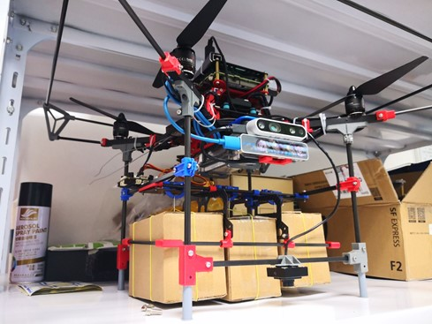
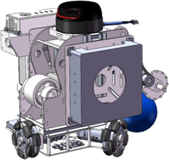

# 基地目前成果

### 1. 四旋翼无人开发平台

### 2. Vwbot轮式小车二次开发平台

+ **第一代轮式小车二次开发平台**

+ **第二代轮式小车二次开发平台**

### 3. 中型轮式车开发平台

Hawking轮式足球机器人自2016年诞生至今，经过了许多代的技术更新，技术处于国内领先水平。在2020年受到了工信部部长肖亚庆同志和西工大校长汪劲松同志的调研和考察。包揽2020年全国机器人锦标赛轮式大类7项冠军

