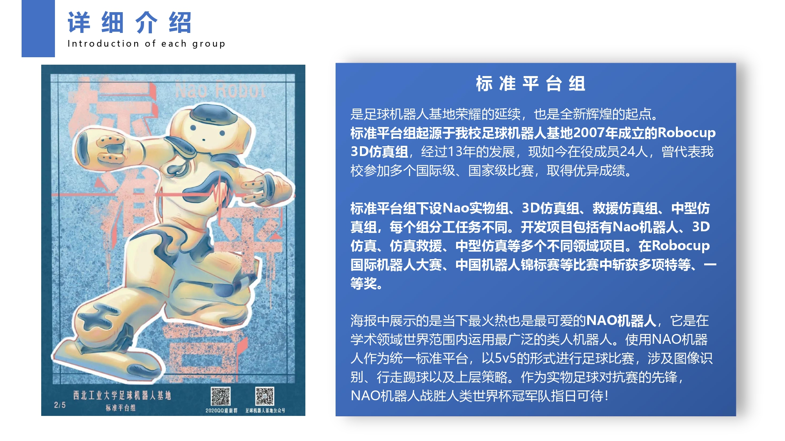
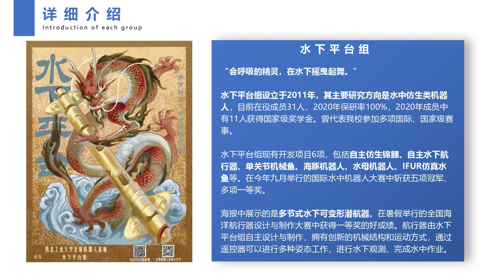
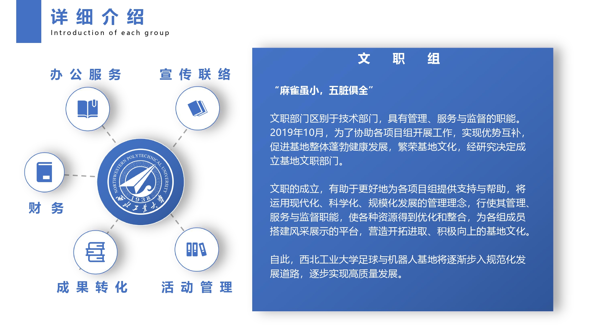
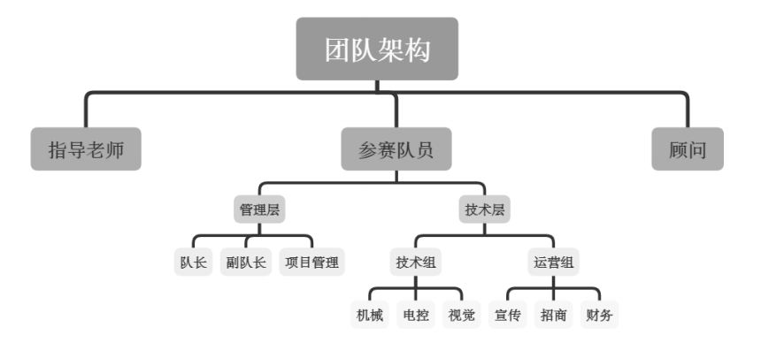

# 基地各组介绍

## V5++

​	传统项目为仿真5V5足球平台，获得中国机器人大赛冠军、全国机器人锦标赛冠军、中国机器人及人工智能大赛冠军等，队伍的轮式车在2019年首次参加世界杯小车项目，获得亚军；2020年首次参加ICRA Robomaster人工智能挑战赛，国际赛中取得第六名好成绩；同时也研究空中机器人项目，获得过全国机器人锦标赛一等奖等一些无人机奖项；仿真避障11V11足球中获得中国机器人大赛冠军、全国机器人锦标赛冠军等奖项。

## 轮组

​	轮式足球机器人，基地的机器人元老之一，依靠全景摄像头捕获的图像在足球门上进行自主定位与自主决策，完成一系列抓球、避障、传球、射门等动作。目前已经历4代技术更新，目前正在完成第五代技术更新，在国内处于领先水平，参加了全国机器人锦标赛、人工智能大赛、FIRA、挑战杯、创新创业大赛等多种比赛，并获得多个国家级奖项。

## 标准平台

​	包括中型仿真组、救援仿真组、3D仿真组、实物NAO组；在中国机器人大赛中型仿真足球赛冠军、Robocup中国赛救援仿真二等奖、2020全国机器人锦标赛多个一等奖。

## 人型

​	自主研发人性格斗机器人“浩劫”机器人，在国内多个机器人赛事中夺得冠军、一等奖等荣誉；设计研发制造全自主魔方机器人；自主开发新一代开放平台小型全自主机器人“莫扎特”机器人，也是关节型类人型机器人。

## 鱼组

​	参加国际水中机器人大赛，并获得包括冠军五项在内的十个奖项；鱼组队员中2人获得学生标兵荣誉，11人获得国家奖学金，4人获得专项奖学金；也参与过ROBOMASTER人工智能挑战赛、两项省级大创等，也自主开发了新式ROV 。

## 文职

​	成立于2019年10月，文职部门区别于技术部门，具有引领、管理、服务与监督的职能，主要负责行政事务。文职成立将更好地为各项目组提供支持与帮助，使各组资源得到优化整合，营造开拓进取、积极向上的基地文化。主要负责事务如下：

1. **办公服务**

   基地相关文件和制度的起草、修订、发放和实施，管理专利软著，基地招新及新成员登记注册，会议会场布置策划，日常会议记录，日常值班，校级以上活动申请审批、获奖名单收集、获奖证书绘制等。

2. **活动管理**

   正确引导各组开展高效培训活动，负责与各组对接，及时掌握工作进度，协助各组顺利开展工作，负责牵头组织开展基地活动方案策划，团队建设，队员培训，组间交流，外场申请等，协助各组进行各项比赛报名，规划外出比赛形成并记录，协助基地各组项目进行中英文答辩。

3. **联络服务**

   定向对接各组组长，与各组建立紧密的合作关系；对各组进行事务通知，并针对各组问题进行答疑；与各组交流及反馈记录的收集整理。

4. **宣传与新媒体**

   负责基地日常宣传工作，包括基地网站、微信公众平台、QQ 平台、哔哩哔哩平台、抖音平台、快手平台、今日头条平台的日常运营，定时推送基地及各组内部建设及活动信息、实时动态； 负责对各组活动进行采集、海报设计、视频制作、摄影、撰写文稿等工作； 负责对基地风采人物进行专访、记录并撰写新闻稿；与校内外媒体紧密联系合作，树立足球机器人基地的良好形象；承办足球机器人基地展览，彰显足球机器人基地实力与风采，提高校内知名度。

## 各组运作关系

