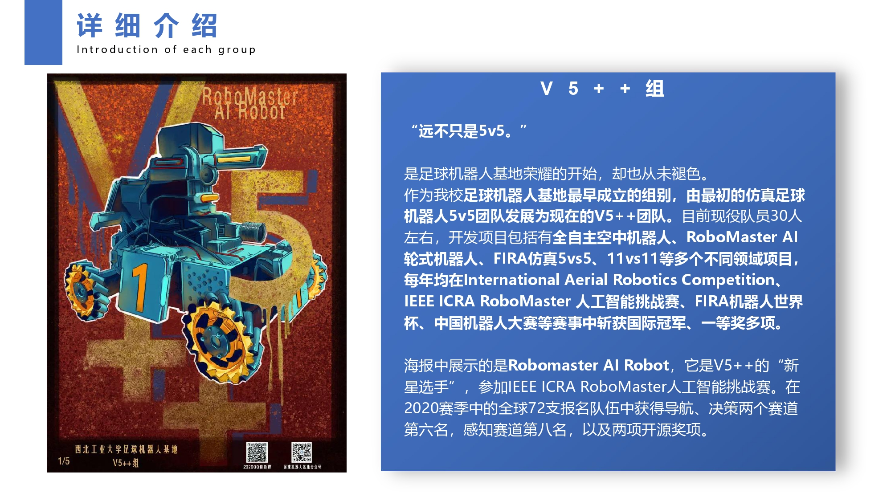
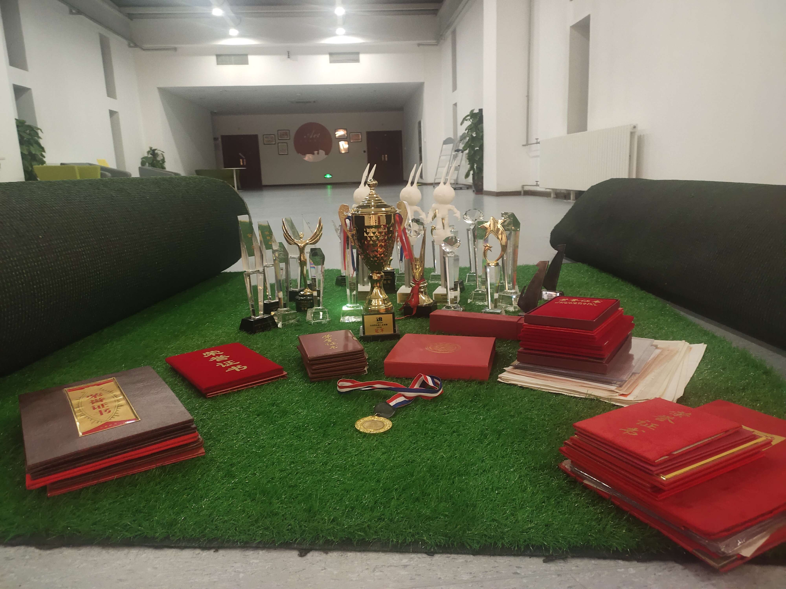
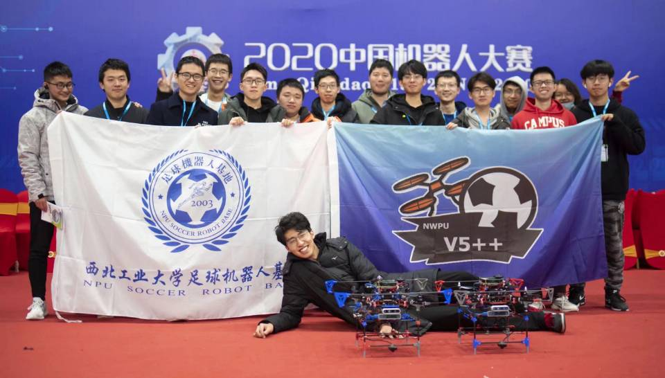
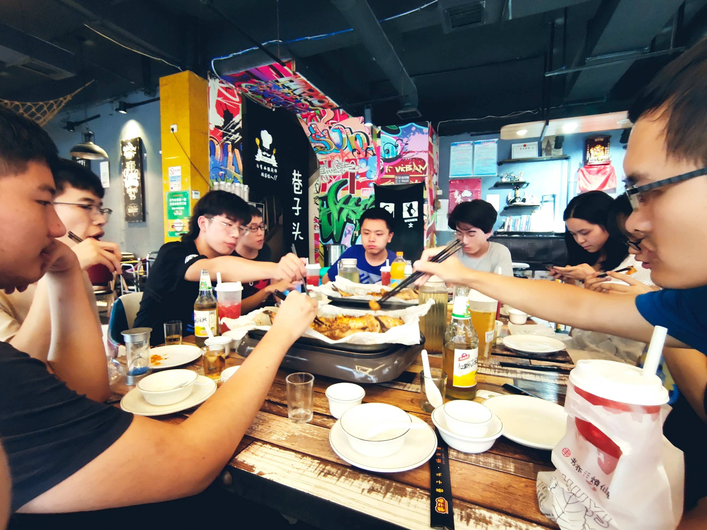
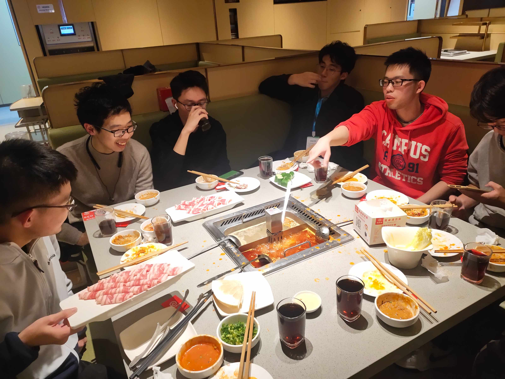

# V5++

## 组别简介

​	传统项目为仿真5V5足球平台，获得中国机器人大赛冠军、全国机器人锦标赛冠军、中国机器人及人工智能大赛冠军等，队伍的轮式车在2019年首次参加世界杯小车项目，获得亚军；2020年首次参加ICRA Robomaster人工智能挑战赛，国际赛中取得第六名好成绩；同时也研究空中机器人项目，获得过全国机器人锦标赛一等奖等一些无人机奖项；仿真避障11V11足球中获得中国机器人大赛冠军、全国机器人锦标赛冠军等奖项。

## 组内分工

按技术面分，组内成员大致分为策略，视觉，导航与定位，技术支持，机械，硬件。

策略成员主要负责每年的仿真比赛，RMUA的策略部分。

视觉成员参与到很多项目中，如无人机的图像识别，RMUA的装甲板识别。

导航与定位成员每年会维护RMUA的雷达定位与导航，飞机的相机定位与导航。

技术支持成员负责维护基地服务器，以及解决大家平常遇到的奇怪问题。

机械与硬件方面的成员负责的事很多，如无人机设计及电路，RMUA车的参数调试，任务主要与实物密切相关。

## 历史沿革

## 群体团建

每个月给当月过生日的队员买蛋糕共同过生日。

学长学姐或基地请客聚餐。

