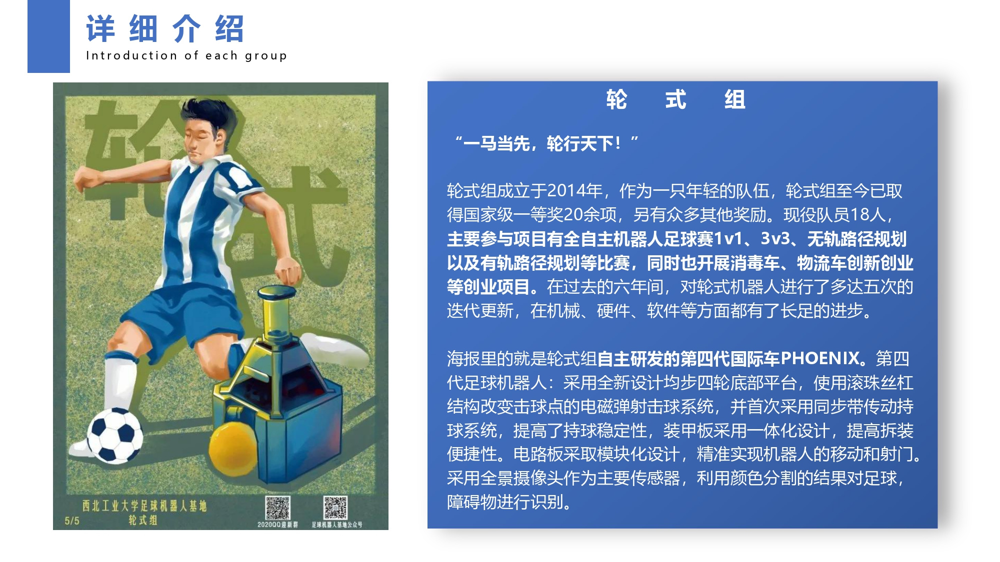

# 西北工业大学足球机器人基地轮式组

## 组别简介

​	轮式足球机器人，基地的机器人元老之一，依靠全景摄像头捕获的图像在足球门上进行自主定位与自主决策，完成一系列抓球、避障、传球、射门等动作。目前已经历4代技术更新，目前正在完成第五代技术更新，在国内处于领先水平，参加了全国机器人锦标赛、人工智能大赛、FIRA、挑战杯、创新创业大赛等多种比赛，并获得多个国家级奖项。

## 组内分工

### 软件组

主要是负责编写和维护上位机的代码,能够与硬件及机械的队员配合调试设备，要求掌握图像处理，界面设计，竞赛策略等相关的知识，要求良好的英文和数学功底，需要英文功底是因为研究高阶算法避不开阅读外文文献。需要数学功底是因为只要是算法都避不开数学推导。

### 硬件组

主要负责嵌入式开发,电路板设计，单片机代码的修改调试，运动学模型构建,自主设计电路为基地的轮式机器人提供完整的驱动控制。要求熟练掌握各项电路电子技术,了解电子元件的工作原理，拥有严谨的工作态度。

### 机械组

主要负责轮式机器人的机械结构设计、制造、装配和维护的工作。在工作中运用创新思维，尽可能提高比赛设备的机械性能与可靠性，并且能够熟练地组装设备、排除机械故障，确保设备能顺利地调试与参赛。要求有较高的机械设计能力，较强的动手能力,同时还要具有创新精神。

## 参与的赛事

### RoboCup 足球机器人世界杯

RoboCup机器人世界杯是世界机器人竞赛领域影响力非常大、综合技术水平高、参与范围广的专业机器人竞赛，由加拿大大不列颠哥伦比亚大学教授 A1an Mackworth 在1992年次提出的。其目的是通过机器人足球比赛，为人工智能和智能机器人学科的发展提供一个具有标志性和挑战性的课题，为相关领域的研究提供一个动态对抗的标准化环境。

### FIRA 世界足球机器人大赛

FIRA世界足球机器人大赛是全球性的机器人足球比赛，每年举行一次。FIRA是国际机器人足球联合会(Federation of International Robot-soccer Association)的缩写。从1996年在韩国大田的KAIST举办第一届比赛至今，FIRA已经举行了二十二届世界杯比赛，是各类国际机器人竞赛中最具水平和影响力的赛事之一。

### 全国机器人锦标赛

全国机器人锦标赛与国际仿人机器人奥林匹克大赛由中国人工智能学会机器人足球工作委员会(CAAI-RSC)主办，是国内规模最大、影响力最强、水平最高的一年一度全国智能机器人技术比武大赛，至今以举办二十届。轮式组在比赛中曾斩获多项大奖。

### 中国机器人及人工智能大赛

中国机器人及人工智能大赛自1999年至2019已成功举办了20届，是国内规模最大，影响力最强，专业水平最高的机器人竞赛。2019年，顺应国内外人工智能研发应用的大趋势，大赛将围绕机器人技术研发和人工智能应用领域创新展开赛事，策划“机器人及人工智能比赛”和“创新比赛”两大项比赛项目。本届大赛将以专业赛事，高峰研讨等多种形式互联互通，众智汇聚，促进机器人及人工智能领域间合作交流。

## 2020-2021 年度荣誉展示

全国机器人锦标赛获得国家级一等奖七项、三等奖一项

人工智能大赛获得国家级一等奖一项、二等奖一项、三等奖一项

中国高校智能机器人获得国家级一等奖一项

全国大学生ICAN创新创业大赛国家级一等奖一项

全国大学生3s物联网各国家级一等奖一项

挑战杯省赛银奖一项

光电大赛国家级三等奖一项

全国海洋航行器与制作大赛水下组全国二等奖三项

……

## 寄语

在这里你将有机会走出国门与国际队伍一较高下，并且在轮式组也有很多兴趣研究项目等待你的参与，希望大家在未来能够成为我们的一员。