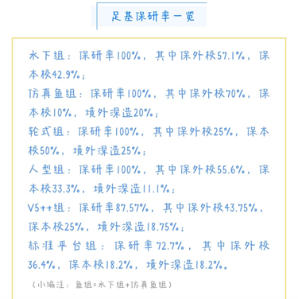

# 基地大佬一览

## 1.2015 级 V5++ 组学长 沈哲伦

+ **在基地期间获得的奖项（只列举了一部分）**

  + 2016-2017年国家奖学金

  + 2017第十九届全国机器人锦标赛仿真11VS11机器人足球赛冠军

  + 2017中国机器人大赛FIRA小型组——仿真11VS11项目冠军

  + 2017第22届FIRA机器人世界杯仿真11VS11比赛项目国际冠军

  + 2017国际水中机器人大赛2D仿真组“花样游泳”项目一等奖

+ **现状**

  目前在北京大学，信息科学技术学院，信号与信息处理专业继续学习，主要研究的方向是量子神经网络，计算机视觉，深度学习。

+ **在基地的奋斗故事**

  比较难忘的经历大概是大二下备战世界赛的时候吧，当时是暑假，天特别热，基地里空调还坏了，就只是坐在里面都可以出一身的汗，但是大家依然呆在基地里面认真地调代码，最后去台湾参赛也取得了很好的结果，也可以说是苦尽甘来吧。

+ **基地对于你之后的就业或者升学起到了什么帮助？**

  我觉得基地对于我最大的帮助在于眼界的开阔，还记得刚进入大二时对于未来几年的发展其实并没有很具体的规划，正是因为加入了基地，认识了一批优秀的学长学姐，耳熏目染之下才懂得了在宝贵的大学四年时光里应该做什么来提升自己，应该去追逐什么样的梦想，无论是去参加数模，还是跟着老师做科研，抑或是保研外校，努力去实现是一方面，我觉得更关键的是意识到自己可以这样做，以及应该如何去做，而这些都离不开和学长学姐的循循善诱与以身作则，也非常感谢基地给我们提供了这样一个开阔眼界，一起变得更好的平台。

---

## 2. 2016级 轮式 组学姐 朱琪

+ **毕业去向**

  加州大学伯克利分校读研

+ **研究方向**

  机器人与嵌入式软件

+ **荣誉信息**

  + 连续两年国家奖学金 (2017，2018)

  + 感恩中国近现代科学家奖学金(2018)

  + 全国机器人锦标赛冠军(2017，2018)

  + 中国机器人及人工智能大赛一等奖(2017，2018)

  + 全国海洋航行器设计与制作大赛二等奖(2017，2018)

  + 美国大学生数学建模竞赛二等奖(2018)

## 3. 2016 级 V5++ 组学长 王凯铎

+ **毕业去向**

  多伦多大学

+ **具体专业**

  MS in Robotic Systems Development (MRSD)

+ **荣誉信息**

  + 2016-2017年度国家奖学金

  + 2017-2018年度国家奖学金

  + 三个FIRA国际机器人竞赛冠军

  + 智能车竞赛西部赛区冠军

  + 入选国家留学基金委(csc)全额资助的Mitacs本科生项目 （全国共200人）

## 4. 2017 级 V5++ 组学长 薛轲翰

+ **毕业去向**

  香港中文大学天石机器人所的PhD Offer（全额奖学金），为上海莱陆科技有限公司联合创始人，目前担任CTO一职。

+ **荣誉信息**

  + 2018 年度国家奖学金
  + 2019 年度本科生科技之星
  + 2019 年度中航技奖学金
  + 2018 全国机器人锦标赛无人机智能操控赛国家冠军
  + 2019 FIRA机器人世界杯无人机室内救援项目国际冠军
  + 2019 新加坡智能水下航行器挑战赛国际冠军
  + 2020 IEEE ICRA RoboMaster 机甲大师人工智能挑战赛全球6/72名

