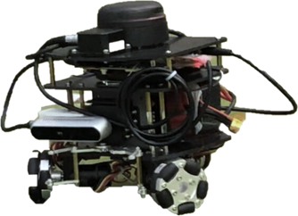
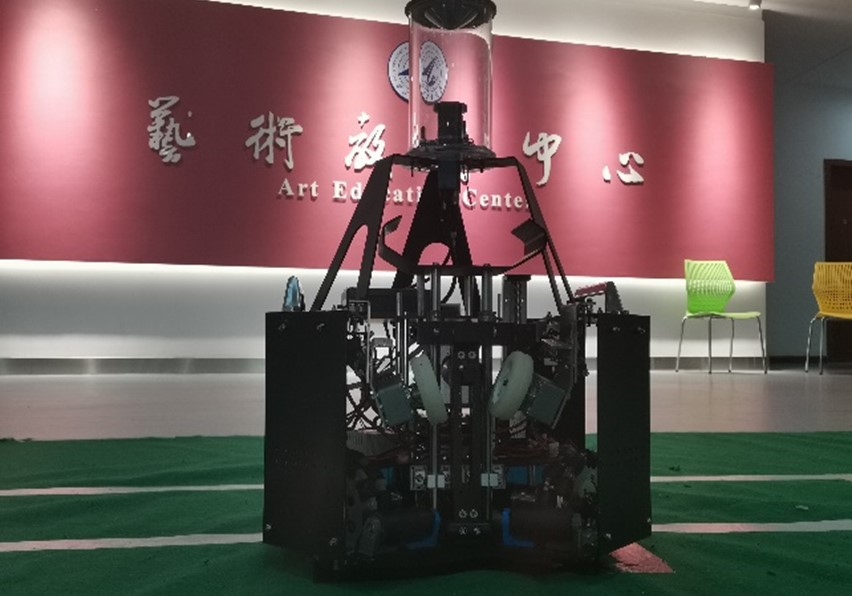
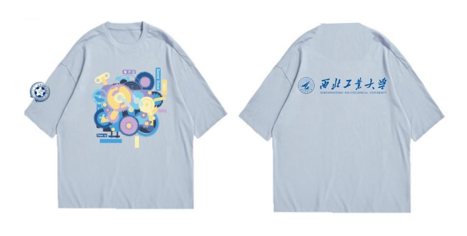
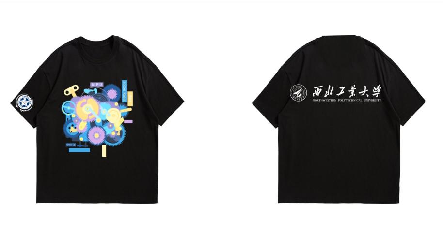

# 足球机器人基地常识

## 一、基地的历史

## 二、基地的现状、荣誉、地位、影响力

### 1.概述

足球机器人基地于2003年于西北工业大学成立，多年来致力于机器人研发、控制及应用工作。实力雄厚，硕果累累，连续 n年获得FIRA RoboWorld Cup、国际仿人机器人奥林匹克大赛、全国机器人锦标赛等高水平机器人比赛冠军。基地共由5个大组组成，分别是：V5++组、人型组、鱼组、轮式组、标准平台组。各组特色鲜明、互相促进，共同构成足球机器人基地大家庭。

### 2.荣誉

基地连续多年获得FIRA机器人足球赛、RoboCup 机器人世界杯中国赛、中国机器人大赛以及全国机器人锦标赛等高水平机器人比赛冠军，不断为学校增添新的荣誉。2019-2020年共获得国际冠军及特等奖13项，国际一等奖4项；国家级冠军31项，国家级一等奖52项；包揽2019FIRA世界杯的空中机器人项目、仿真项目全部7项冠军。

## 三、基地的未来规划

### 1.规章制度

+ **日常集训**

  足球机器人基地实行集训制度。队员进入每个组之后，根据组内规章制度安排集训时间。如果临时有事情与集训时间冲突，需向组长请假说明情况，不得无故缺席。

+ **假期集训**

  足球机器人基地在寒假以及暑假会留校集训一段时间。寒假一般为2-3周，暑假一般为一个月左右，具体时间看组内安排。

  在假期集训时间可以到其余各组进行交流学习，技术上互通有无。

  集训内容：准备比赛、学习新的知识内容、完成大创、申请专利软著等。

  注意事项：安全第一（用电安全+代码安全）、工位安排、自备电脑。

+ **纪律**

  无故不得迟到以及早退。

  因事请假需提前一天，并向组长说明原因。

  积极完成组织各项任务。

  集训时间不得做与基地无关的事

  不得将基地集训时间的成果自行转化

  不得私自泄露或外传基地成果（代码、设备、基地等）

### 2.权利

+ 基地环境安静舒适，队员们可以随时来基地看书自习。
+ 队员们可以免费借阅基地的书籍，和足基队友一起研究学习。
+ 队员可以使用免费并且高速的WiFi。
+ 队员们遇到特殊情况，可以请假。
+ 队员们可以随时提出自己的意见和建议。无论是足基举办的活动还是日常管理。

### 3.义务

+ 认真工作，按时并保质保量完成组织布置的任务。
+ 自觉维护组织形象。公开发表某种言论或做某种事情请三思而后行。
+ 自觉保持基地环境整洁。
+ 自觉维护足基财产及代码安全。
+ 享受足基资源的同时，也要从中不断进步。部分组别采用淘汰制度，学期后会对组员进行考核，考核不通过即自动退出基地。

### 4.公司

+ **公司名称**：西安六爻飞梦信息科技有限公司
+ **目标：**提供更低门槛的机器人项目实践机会，培养高端科研人才和领军人才
+ **主营：**与机器人相关产业与服务
+ **项目团队：**西北工业大学大学生足球机器人创新实践基地

### 5.指导老师

+ **指导老师**：史豪斌老师（计算机学院）

+ **职称：** 教授，博士生导师

+ **研究方向：**决策支持、分布式人工智能、多智能体机器人系统、智能机器人、机器学习技术、网络安全、电子商务技术、软件工程。

+ **主要成果：**

  在国内外重要期刊及国际会议上发表学术论文60余篇，其中被SCI、EI索引50余篇。

  作为西北工业大学机器人竞赛项目负责人，带领学生参加国内外机器人大赛获得世界冠军20项、亚军5项，国际一等奖50余项，全国冠军、特等奖、一等奖100余项。

  获得发明专利6项，计算机软件著作权30余项，出版教材1部。

  作为核心骨干，参与科技部重点研发计划1项，国际“十五”、“十一五”等4项国家部委重大决策支持课题项目，参与国家863项目等科研课题10余项。

### 6.项目负责人

+ **负责人姓名**：王权涛（博士）

+ **荣誉列表**：

  西安六爻飞梦信息科技有限公司创始人及法人

  西工大足球与竞技机器人基地队长

  FIRA世界杯联席裁判

  师从史豪斌副教授，曾荣获2020年西工大竞赛之星、2020年国家奖学金、多项FIRA世界杯冠军、多项机器人大赛冠军

### 7.目前产品

#### 四旋翼无人开发平台

#### Vwbot轮式小车二次开发平台

+ 第一代轮式小车二次开发平台

+ 第二代轮式小车二次开发平台

#### 中型轮式车开发平台

Hawking轮式足球机器人自2016年诞生至今，经过了许多代的技术更新，技术处于国内领先水平。在2020年受到了工信部部长肖亚庆同志和西工大校长汪劲松同志的调研和考察。包揽2020年全国机器人锦标赛轮式大类7项冠军

## 四、基地的各组大佬介绍

### 1.2015 级 V5++ 仿真组学长 沈哲伦

+ **在基地期间获得的奖项（只列举了一部分）**

  + 2016-2017年国家奖学金

  + 2017第十九届全国机器人锦标赛仿真11VS11机器人足球赛冠军

  + 2017中国机器人大赛FIRA小型组——仿真11VS11项目冠军

  + 2017第22届FIRA机器人世界杯仿真11VS11比赛项目国际冠军

  + 2017国际水中机器人大赛2D仿真组“花样游泳”项目一等奖
  
+ **现状**

  目前在北京大学，信息科学技术学院，信号与信息处理专业继续学习，主要研究的方向是量子神经网络，计算机视觉，深度学习。

+ **在基地的奋斗故事**
  
  比较难忘的经历大概是大二下备战世界赛的时候吧，当时是暑假，天特别热，基地里空调还坏了，就只是坐在里面都可以出一身的汗，但是大家依然呆在基地里面认真地调代码，最后去台湾参赛也取得了很好的结果，也可以说是苦尽甘来吧。
  
+ **基地对于你之后的就业或者升学起到了什么帮助？**
  
  我觉得基地对于我最大的帮助在于眼界的开阔，还记得刚进入大二时对于未来几年的发展其实并没有很具体的规划，正是因为加入了基地，认识了一批优秀的学长学姐，耳熏目染之下才懂得了在宝贵的大学四年时光里应该做什么来提升自己，应该去追逐什么样的梦想，无论是去参加数模，还是跟着老师做科研，抑或是保研外校，努力去实现是一方面，我觉得更关键的是意识到自己可以这样做，以及应该如何去做，而这些都离不开和学长学姐的循循善诱与以身作则，也非常感谢基地给我们提供了这样一个开阔眼界，一起变得更好的平台。

---

### 2. 2016级 轮式组学姐 朱琪

+ **毕业去向**

  加州大学伯克利分校读研

+ **研究方向**

  机器人与嵌入式软件

+ **荣誉信息**

  + 连续两年国家奖学金 (2017，2018)

  + 感恩中国近现代科学家奖学金(2018)

  +　全国机器人锦标赛冠军(2017，2018)

  + 中国机器人及人工智能大赛一等奖(2017，2018)

  + 全国海洋航行器设计与制作大赛二等奖(2017，2018)

  + 美国大学生数学建模竞赛二等奖(2018)

### 3. 2016级 V5++组学长 王凯铎 16级自动化专业本科生

+ **毕业去向**

  卡耐基梅隆大学(robotics institute CMU的机器人学院)

+ **具体专业**

  MS in Robotic Systems Development (MRSD)

+ **荣誉信息**

  + 2016-2017年度国家奖学金

  + 2017-2018年度国家奖学金

  +　三个FIRA国际机器人竞赛冠军

  + 智能车竞赛西部赛区冠军

  + 入选国家留学基金委(csc)全额资助的Mitacs本科生项目 （全国共200人）

## 五、队服设计展示

