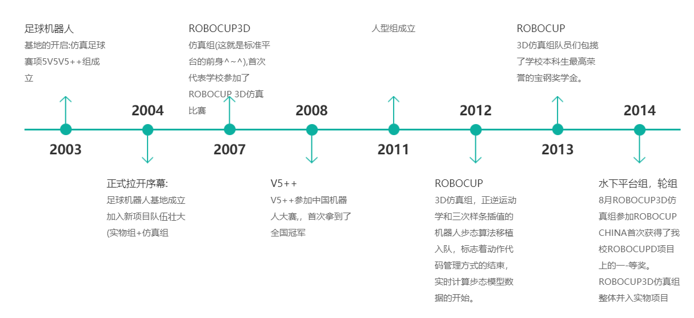
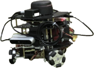

# 足球机器人基地常识

## 一、基地的历史

## 二、基地的现状、荣誉、地位、影响力

### 1.概述

足球机器人基地于2003年于西北工业大学成立，多年来致力于机器人研发、控制及应用工作。实力雄厚，硕果累累，连续 n年获得FIRA RoboWorld Cup、国际仿人机器人奥林匹克大赛、全国机器人锦标赛等高水平机器人比赛冠军。基地共由5个大组组成，分别是：V5++组、人型组、鱼组、轮式组、标准平台组。各组特色鲜明、互相促进，共同构成足球机器人基地大家庭。

### 2.荣誉

基地连续多年获得FIRA机器人足球赛、RoboCup 机器人世界杯中国赛、中国机器人大赛以及全国机器人锦标赛等高水平机器人比赛冠军，不断为学校增添新的荣誉。2019-2020年共获得国际冠军及特等奖13项，国际一等奖4项；国家级冠军31项，国家级一等奖52项；包揽2019FIRA世界杯的空中机器人项目、仿真项目全部7项冠军。

## 三、基地的未来规划

### 1.规章制度

+ **日常集训**

  足球机器人基地实行集训制度。队员进入每个组之后，根据组内规章制度安排集训时间。如果临时有事情与集训时间冲突，需向组长请假说明情况，不得无故缺席。

+ **假期集训**

  足球机器人基地在寒假以及暑假会留校集训一段时间。寒假一般为2-3周，暑假一般为一个月左右，具体时间看组内安排。

  在假期集训时间可以到其余各组进行交流学习，技术上互通有无。

  集训内容：准备比赛、学习新的知识内容、完成大创、申请专利软著等。

  注意事项：安全第一（用电安全+代码安全）、工位安排、自备电脑。

+ **纪律**

  无故不得迟到以及早退。

  因事请假需提前一天，并向组长说明原因。

  积极完成组织各项任务。

  集训时间不得做与基地无关的事

  不得将基地集训时间的成果自行转化

  不得私自泄露或外传基地成果（代码、设备、基地等）

### 2.权利

+ 基地环境安静舒适，队员们可以随时来基地看书自习。
+ 队员们可以免费借阅基地的书籍，和足基队友一起研究学习。
+ 队员可以使用免费并且高速的WiFi。
+ 队员们遇到特殊情况，可以请假。
+ 队员们可以随时提出自己的意见和建议。无论是足基举办的活动还是日常管理。

### 3.义务

+ 认真工作，按时并保质保量完成组织布置的任务。
+ 自觉维护组织形象。公开发表某种言论或做某种事情请三思而后行。
+ 自觉保持基地环境整洁。
+ 自觉维护足基财产及代码安全。
+ 享受足基资源的同时，也要从中不断进步。部分组别采用淘汰制度，学期后会对组员进行考核，考核不通过即自动退出基地。

### 4.公司

+ **公司名称**：西安六爻飞梦信息科技有限公司
+ **目标：**提供更低门槛的机器人项目实践机会，培养高端科研人才和领军人才
+ **主营：**与机器人相关产业与服务
+ **项目团队：**西北工业大学大学生足球机器人创新实践基地

### 5.指导老师

+ **指导老师**：史豪斌老师（计算机学院）

+ **职称：** 教授，博士生导师

+ **研究方向：**决策支持、分布式人工智能、多智能体机器人系统、智能机器人、机器学习技术、网络安全、电子商务技术、软件工程。

+ **主要成果：**

  在国内外重要期刊及国际会议上发表学术论文60余篇，其中被SCI、EI索引50余篇。

  作为西北工业大学机器人竞赛项目负责人，带领学生参加国内外机器人大赛获得世界冠军20项、亚军5项，国际一等奖50余项，全国冠军、特等奖、一等奖100余项。

  获得发明专利6项，计算机软件著作权30余项，出版教材1部。

  作为核心骨干，参与科技部重点研发计划1项，国际“十五”、“十一五”等4项国家部委重大决策支持课题项目，参与国家863项目等科研课题10余项。

### 6.项目负责人

+ **负责人姓名**：王权涛（博士）

+ **荣誉列表**：

  西安六爻飞梦信息科技有限公司创始人及法人

  西工大足球与竞技机器人基地队长

  FIRA世界杯联席裁判

  师从史豪斌副教授，曾荣获2020年西工大竞赛之星、2020年国家奖学金、多项FIRA世界杯冠军、多项机器人大赛冠军

### 7.目前产品

#### 四旋翼无人开发平台

#### Vwbot轮式小车二次开发平台

